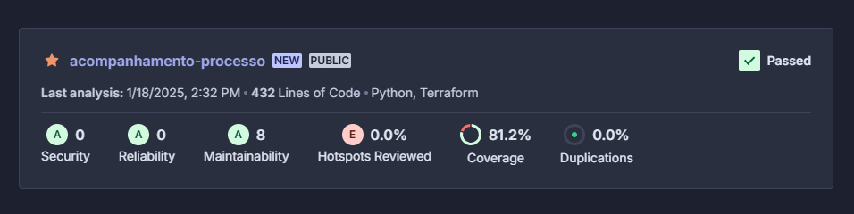

# Acompanhamento do Processamento - Microserviço

Este é um microserviço para acompanhamento do status do processamento dos arquivos enviados pelo usuário através de diferentes status: **Recebido**, **Verificado**, **Gerado** e **Notificado**.

## Tecnologias Utilizadas

- **Banco de Dados**: AWS dynamoDB
- **Implantação**: Lambda AWS
- **API Gateway**: Utiliza um proxy reverso para gerenciar as requisições
- **Infraestrutura como Código**: Terraform para provisionamento na AWS

## Pré-requisitos

Antes de começar, você precisará ter instalado:

- [Python](https://www.python.org/)
- [Terraform](https://www.terraform.io/downloads.html)
- Acesso à conta da [AWS](https://aws.amazon.com/)

## Implantação

1. **Clone o repositório**:
   ```bash
   git clone <URL_DO_REPOSITORIO>
   cd <NOME_DO_REPOSITORIO>
   ```

2. **Provisionamento da Infraestrutura**:
   - Navegue até o diretório do Terraform:
     ```bash
     cd infrastructure/terraform
     ```
   - Execute os comandos do Terraform:
     ```bash
     terraform init
     terraform apply
     ```

## Implantação Automática com GitHub Actions

A implantação da aplicação é gerenciada automaticamente através do GitHub Actions. Quando você faz um push para a branch `main`, o fluxo de trabalho definido em `.github/workflows/deploy-infra-lambda.yaml` é acionado. Este fluxo de trabalho inclui as seguintes etapas:

1. **run_tests**: Executa os testes unitários.
2. **sonar_analysis**: Realiza a analise estática do código.
3. **package**: Empacota o código para implantação no ambiente.
4. **upload_to_s3**: Envia o pacote para o bucket S3
5. **deploy**: Realiza o deploy da aplicação no ambiente.

Para mais detalhes sobre o fluxo de trabalho, consulte o arquivo `.github/workflows/deploy-infra-lambda.yaml`.

## Execução

Após a implantação, você pode acessar a aplicação através do API Gateway configurado. Utilize as rotas apropriadas para interagir com a api de acompanhamento.

## Contribuição

Contribuições são bem-vindas! Sinta-se à vontade para abrir um pull request ou relatar problemas.

## Licença

Este projeto está licenciado sob a MIT License - veja o arquivo [LICENSE](LICENSE) para mais detalhes.

## Cobertura de Testes

Abaixo está a captura de tela do resultado da cobertura de testes do SonarQube:

  <!-- Ajuste o caminho e o nome do arquivo conforme necessário -->
